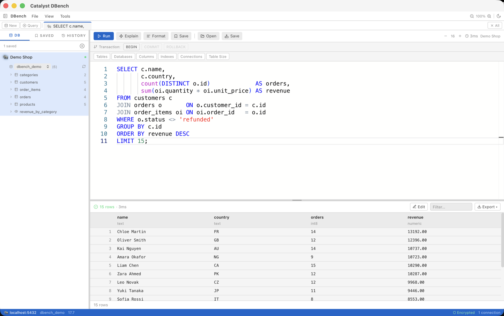
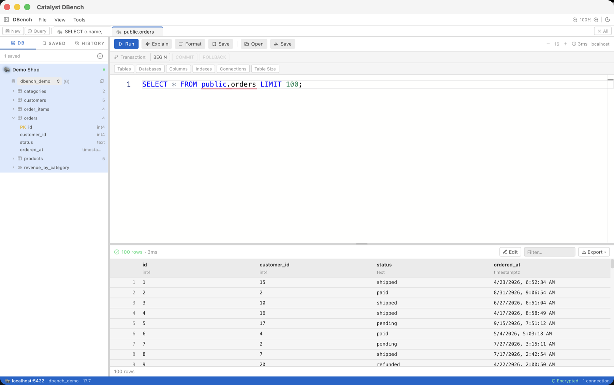
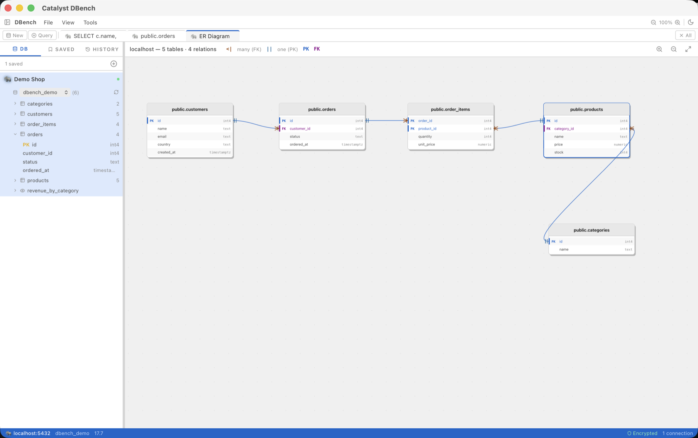
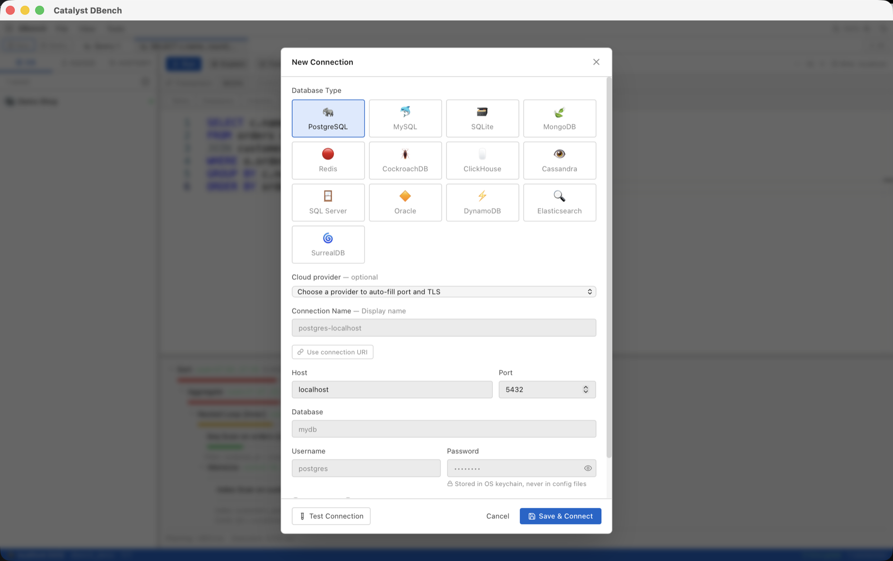
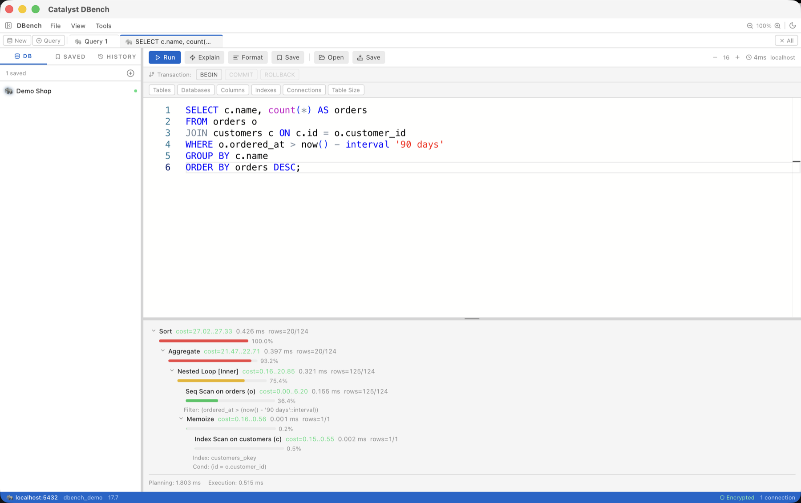
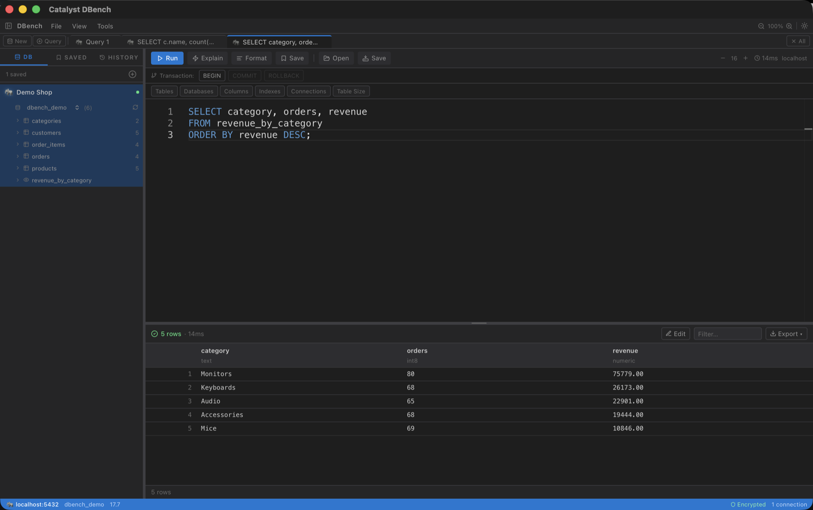

# Catalyst DBench

**One fast, open-source desktop IDE for all your databases.** Built in Rust with Tauri.

- **13 databases, one app:** PostgreSQL, MySQL, SQLite, SQL Server, Oracle, MongoDB, Redis, DynamoDB, Elasticsearch / OpenSearch, ClickHouse, Cassandra, CockroachDB and SurrealDB, plus presets for Aurora, RDS, Supabase and [40+ cloud services](docs/databases.md)
- **Native and light:** Rust backend, no Electron
- **Secure by default:** passwords in the OS keychain, verified TLS, enforced read-only mode, audit log
- **No telemetry**

## Install

Download the installer for your OS from the [latest release](https://github.com/hadihaider055/catalyst-dbench/releases/latest): `.dmg` for macOS (`aarch64` for Apple Silicon, `x64` for Intel), `.msi` / `-setup.exe` for Windows, `.AppImage` / `.deb` / `.rpm` for Linux.

The builds aren't code-signed yet. On macOS, right-click the app → **Open** the first time. See [installation](docs/installation.md) for Windows/Linux notes, Oracle, and building from source.

## Screenshots

| Schema browser and data grid | ER diagram |
| --- | --- |
|  |  |
| **New connection** | **Explain plan** |
|  |  |
| **Dark theme** | |
|  | |

## Features

- Monaco editor with autocomplete, snippets, formatting and multi-statement batches
- Schema explorer, ER diagram and visual `EXPLAIN` plans
- Data grid with sorting, filtering, inline editing, and CSV/JSON import and export
- SSH tunnels, connection URIs, cloud presets and a database switcher
- Tabs, query history, dark and light themes

## Docs

- [Supported databases](docs/databases.md)
- [Installation and building from source](docs/installation.md)
- [Connecting](docs/connecting.md): per-database fields, AWS certificates, query examples
- [Security](docs/security-architecture.md)
- [Architecture and testing](docs/architecture.md)
- [Changelog](CHANGELOG.md)

## Contributing

Contributions are welcome. See [CONTRIBUTING.md](CONTRIBUTING.md); to report a vulnerability, see [SECURITY.md](SECURITY.md).

## License

Dual-licensed under [MIT](LICENSE-MIT) or [Apache 2.0](LICENSE-APACHE), at your option.
